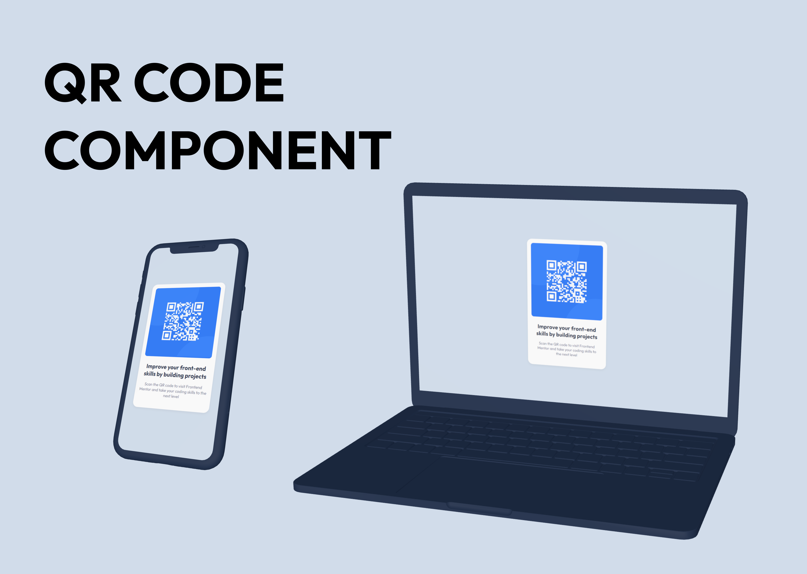
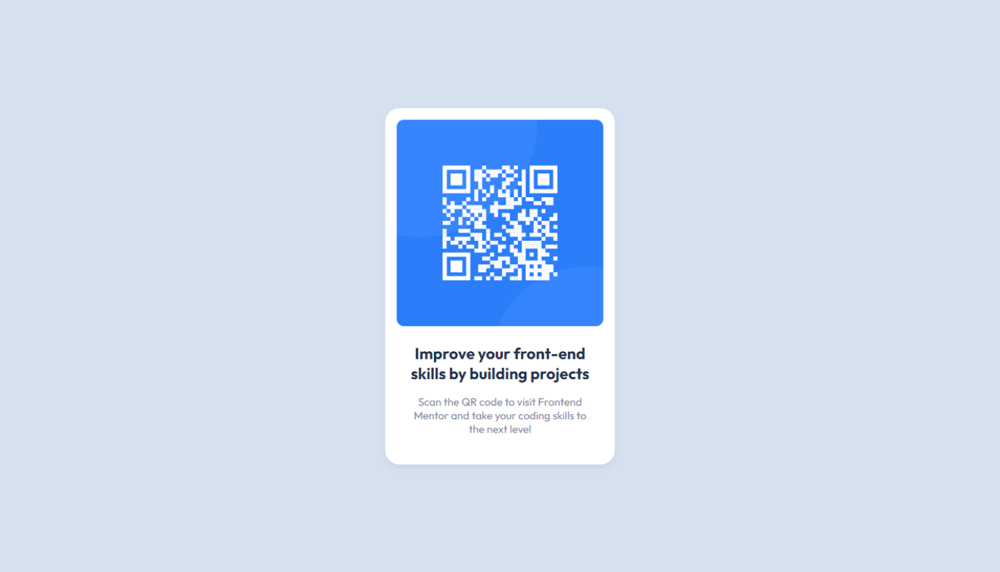

# Frontend Mentor - QR code component solution

This is a solution to the [QR code component challenge on Frontend Mentor](https://www.frontendmentor.io/challenges/qr-code-component-iux_sIO_H). Frontend Mentor challenges help you improve your coding skills by building realistic projects.

## Table of contents

- [Overview](#overview)
  - [Screenshot](#screenshot)
  - [Links](#links)
- [My process](#my-process)
  - [Built with](#built-with)
- [Author](#author)

## Overview

### Screenshot

### Links

- Solution URL: [Solution URL](https://www.frontendmentor.io/solutions/qr-code-component-with-flexbox-and-responsive-for-mobile-iKFKdqdlSk)
- Live Site URL: [Live Site URL](https://rohmatsetiawanmta.github.io/fem-qr-code-component)
- Own Website URL: [Own Website URL](https://codingmat.com/frontend-mentor/qr-code-component)

## My process

### Built with

- HTML5
- CSS custom properties
- Flexbox

## Author

- Website - [Rohmat Setiawan](https://codingmat.com)
- Frontend Mentor - [@rohmatsetiawanmta](https://www.frontendmentor.io/profile/rohmatsetiawanmta)
